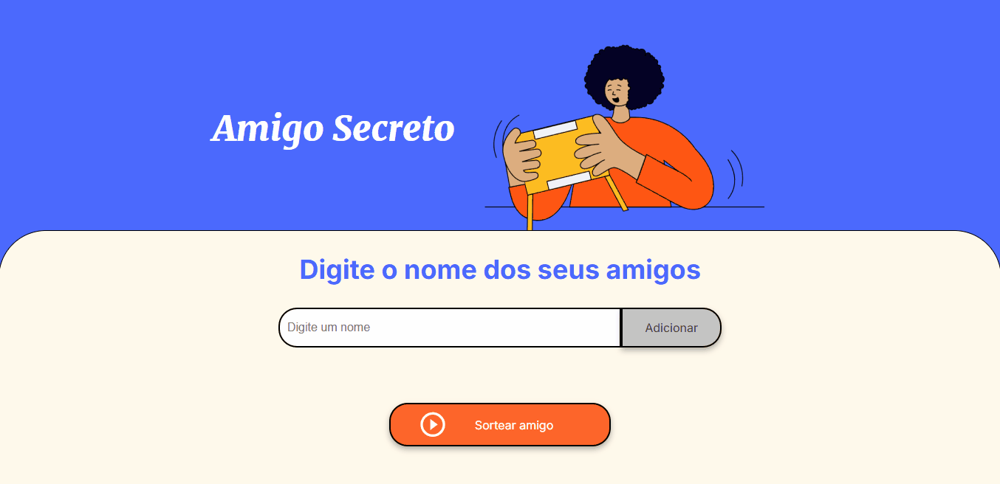

<h1 align="center"> Projeto do amigo secreto</h1>

Esse projeto tem a funcionalidade de sortear um nome de amigo dentre a lista de amigos que serão inseridos pelo usuário, para que o sorteado seja defiido como o amigo secreto do usuário.

# :hammer: Funcionalidades do projeto

- 
O usuário pode inserir nomes, um por vez, para entrarem em uma lista.

- 
Após inserir todos os nomes desejados, o usuário pode clicar em sortear amigo, onde será escolhido, de forma aleatória, um dos nomes da lista e exibido em tela.

- 
Existem validações na tela para que o usuário não insira um valor vazio para sorteio.
